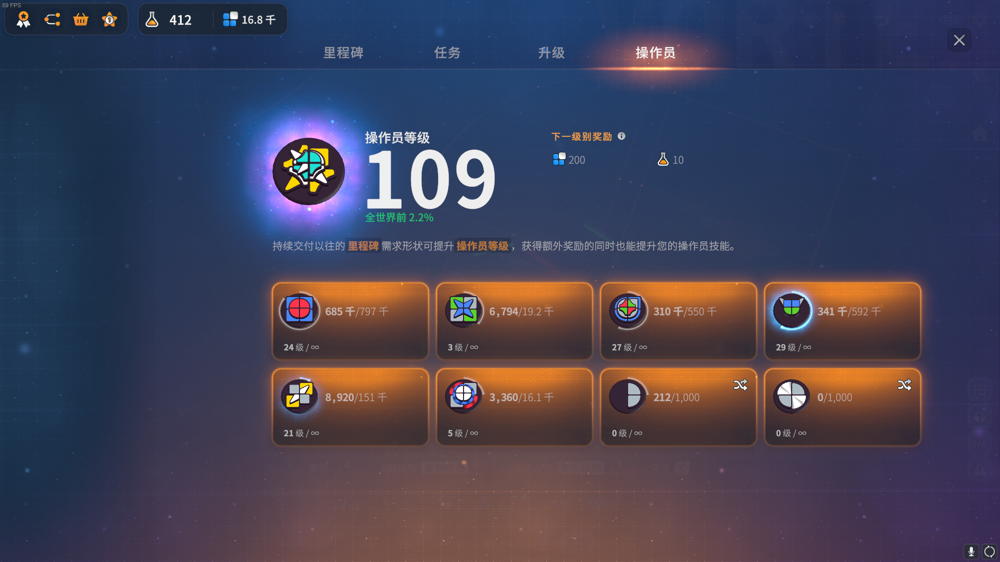
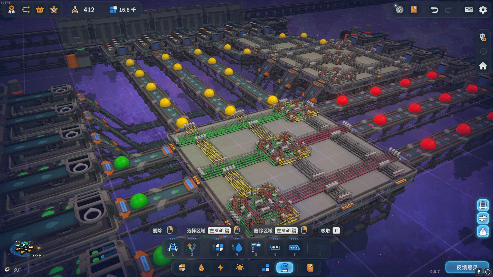
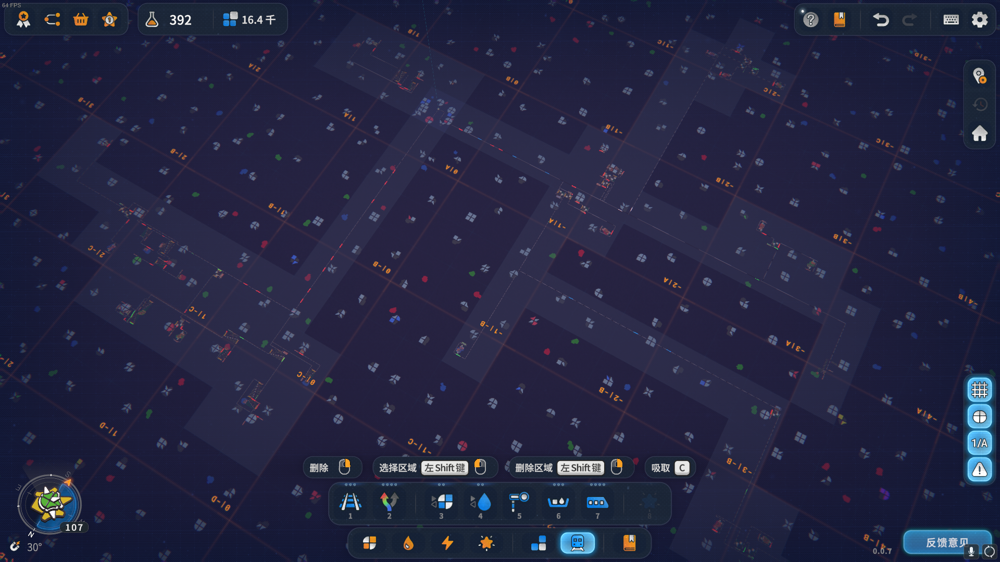

# Shapez2-Blueprint

* Records my blueprint in game [shapez2](https://store.steampowered.com/app/2162800/shapez_2/)
* Some blueprints refer to [zhcn000000](https://github.com/zhcn000000/myshapez2blueprint)
  * `多层混色单元`
* My world in 2024.8.19
  * 
  * 
  * 